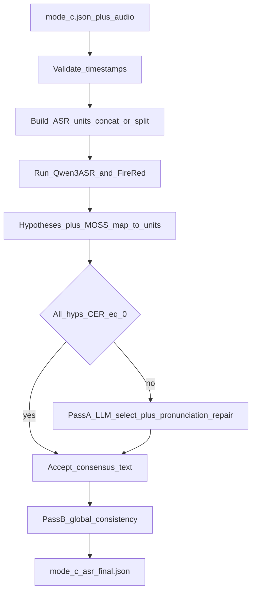

# Stage-2 Multi-ASR + LLM Fusion (Architecture)

**Date:** 2026-07-24  
**Status:** Draft for teammate discussion  
**Scope:** Stage-2 only — consume `diarizen_moss_fusion` (Mode C) outputs; do not re-run Stage-1 diarization fusion.

## Overview

Improve ASR accuracy on top of fused diarization turns by:

1. Validating timestamps and building same-speaker ASR units (concat / split)
2. Running Qwen3-ASR-1.7B + FireRedASR (plus MOSS provisional text when present)
3. Skipping the text LLM when hypotheses agree (CER = 0)
4. Otherwise running Pass A LLM select + Tier A–C repair (±10 min context)
5. Always running Pass B global consistency

Diarization `(start, end, speaker_id)` stays frozen. Stage-2 may update `text` and set `asr_status=final`.

## Locked decisions

| Topic | Choice |
| ----- | ------ |
| Extra ASR | Qwen3-ASR-1.7B + FireRedASR (plus MOSS provisional when present) |
| Overlap policy | **MOSS-primary**: other ASRs may run but cannot beat MOSS by majority alone; LLM base defaults to MOSS |
| Concat audio | Same-speaker diarization concat **even if overlap exists** in the timeline crop; sentence completeness preferred over clean single-speaker audio |
| LLM role | Select + tiered repair capped at **Tier C** (no hotword-only Tier D gate) |
| Repair license | A select/merge → B exact pinyin → **C fuzzy pinyin + anchor** (hotword *or* ±10 min draft / meeting recurrence). Hotwords help but are **not** required |
| Context | Pass A: ±10 min neighbor **draft**; on overlap units, mark `OVERLAP` and prefer MOSS; target unit gets full hyps + hotwords |
| Agreement gate | Clean speech: all hyps CER=0 → skip LLM. **Overlap:** ignore non-MOSS-only consensus; do not skip in a way that drops MOSS |
| Short skip | Duration **&lt; 0.35 s** → no ASR |
| Pass B | **Required** global constrained consistency; MOSS-aware on overlap turns |
| Judge LLM | Qwen3.6-27B-class (DeepSeek swap-in); same contract |

## Pipeline



## 1. Input validation

Before any audio work, validate each turn:

- `start` / `end` present, numeric, finite
- `end > start`
- Skip illegal turns (record in meta: `skipped_invalid_ts`); do not feed ASR

Optional: clamp tiny float noise; do not “repair” inverted times.

## 2. ASR unit construction (concat / split)

ASR does **not** always run on raw fused turns. Build **ASR units** as follows.

### 2.1 Concatenation (same speaker only)

Walk turns in time order. Merge into one ASR unit only when **all** hold:

- Same `speaker_id`
- **Adjacent** in the validated timeline (no other valid turn between them)
- Inter-turn gap `next.start - prev.end <= 5.0 s` (if gap **> 5 s**, start a new unit)
- Merged media duration: use span `unit_end - unit_start` (includes intra-unit silence) **<= 30.0 s**

If adding the next turn would exceed 30 s, close the current unit and start a new one with that turn.

**Different speakers never concatenate.**

Audio for a multi-turn unit: crop `[unit_start, unit_end]` from prepared wav (gaps remain as silence). **Overlap from other speakers inside that span is accepted** — diarization-based concat prioritizes sentence completeness over isolating a single voice. Mark the unit `contains_overlap=true` if any other speaker intersects the unit span; downstream uses MOSS-primary rules.

### 2.2 Split long segments

If a **single** turn (or a unit that cannot be split by turn boundaries) has duration **> 30 s**:

- Split at the **minimum-energy** point in a search region that yields two pieces each **<= 30 s** (recurse if still too long)
- Prefer splits not too close to edges (e.g. avoid outer 10% unless necessary)
- Child pieces become separate ASR units; retain parent turn id(s) for map-back

### 2.3 Duration gate vs concat

- Units (or leftover fragments) with duration **&lt; 0.35 s** → no ASR, no LLM; leave original text/`asr_status`
- Prefer concatenating short same-speaker turns **before** applying the 0.35 s skip when merge would make a unit ≥ 0.35 s (so brief words in a burst still get ASR)

## 3. Multi-ASR hypotheses

For each eligible ASR unit:

- Run **Qwen3-ASR-1.7B** and **FireRedASR** on the unit crop
- Attach **MOSS** text when the unit maps to turns that already have provisional text (if multiple MOSS turns were concatenated: concatenate their texts in order with a separator, or prefer timestamped MOSS fragments if available)
- Store raw hyps in `asr_hypotheses.json`

### Map ASR text back to original turns

Priority:

1. If an ASR model returns **word/segment timestamps**, assign tokens to member turns by time overlap
2. Else keep hypothesis at **unit** level for agreement/LLM; after final text is chosen, split to member turns by token timestamps from a lightweight aligner, or by relative turn durations only as last resort (document as weaker path)

Final JSON still emits **one row per original fused turn** (boundaries/speakers unchanged).

## 4. Agreement gate

- Normalize for compare only: whitespace; light full/half-width punct unify
- For Chinese, “WER = 0” means **character-level CER = 0** among all non-empty hyps for that unit
- **Non-overlap:** if all hyps CER=0 → accept, skip Pass A
- **Overlap (`contains_overlap`):** never treat “Qwen==FireRed ≠ MOSS” as consensus; default draft base = MOSS; still run Pass A when any non-MOSS disagrees with MOSS **or** hotwords may apply (so MOSS can get pronunciation/hotword repair). Skip Pass A only if MOSS equals all others or MOSS-only and no hotword hit
- Single hyp: skip Pass A unless hotwords / Pass B may apply

## 4.1 Overlap handling (MOSS-primary)

For units with `contains_overlap=true`:

- Still run Qwen3-ASR + FireRed (concat may include overlap; expected weaker)
- LLM / selection: **base = MOSS**
- Other hyps are advisory: a non-MOSS span may be used only if pronunciation-compatible with MOSS (or Tier B/C evidence below) — **not** because two non-MOSS models agree with each other
- Prompt must include an `OVERLAP=true` flag and the instruction: do not discard MOSS content to follow cleaner-looking single-speaker ASR

## 5. Pass A — evidence ladder (rules + prompt)

**When:** disagreement, or overlap+repair path, or hyps look broken but Tier C still applies.

**Context:** target hyps + ±10 min draft neighbors + optional hotwords + `contains_overlap` flag. Precompute **pinyin** for hyp spans and hotwords; do not rely on the LLM to invent pinyin.

### Evidence ladder (strict order; **max = Tier C**)

Hotwords help but are **not** required — Tier C anchors can be neighbor/meeting draft alone.

| Tier | Name | When allowed | Evidence required | Risk |
| ---- | ---- | ------------ | ----------------- | ---- |
| A | Select / merge | Normal | Span appears in ≥1 hyp | Lowest |
| B | Exact pronunciation | Wrong characters, right sound | Tone-insensitive pinyin(candidate) == pinyin(ASR span); prefer hotword canonical if listed | Low |
| C | Fuzzy pronunciation + context anchor | ASR near-miss **or all hyps wrong but recoverable** | Pinyin edit distance ≤ threshold (default ≤2) to *some* hyp span, **and** at least one anchor: (1) candidate already in ±10 min neighbor draft, **or** (2) candidate appears elsewhere in meeting draft/hyps, **or** (3) candidate ∈ hotword table (optional) | Medium |

**No Tier D.** No open world-knowledge rewrite without phonetic link + context/hotword anchor.

**Still forbidden:**

- Adding clauses/facts/numbers/names with **no** Tier A–C evidence
- Changing speakers/timestamps
- Fluent paraphrase not justified by sound + anchor

### “All ASR wrong” under Tier C

Allowed when the replacement is still **pronunciation-near** some hyp span (fuzzy pinyin) **and** anchored by dialogue/meeting recurrence (hotword optional).  
If there is **no** phonetic similarity to any hyp and the term never appears in draft/hotwords → keep best hyp (MOSS on overlap).

### Prompt shape (contract)

```text
You are correcting meeting ASR. Output JSON only.
Priority: fidelity to speech > fluency.

Flags: OVERLAP={true|false}. If OVERLAP, base_model must be moss unless a Tier B/C span swap is justified.

Hypotheses: ... (raw text + pinyin)
Hotwords (optional): ... (canonical, aliases, pinyin)
Neighbor draft (±10 min): ...

For each edit: {span_asr, span_out, tier, pinyin_asr, pinyin_out, anchor?}
anchor ∈ {hyp, neighbor_draft, meeting_draft, hotword}
Use the weakest tier that works. Prefer keep ASR if unsure.
Max tier = C. Never add content without Tier A–C evidence.
```

Low temperature; reject/retry if edits lack `tier` or Tier C lacks `anchor`.

**Output:** `{ text, base_model, edits[], overlap }` with `tier` ∈ `A|B|C|punct`.

## 6. Pass B — required global consistency (fifth stage)

Always run after a full-meeting draft exists:

- Enforce consistent spelling via recurrence across meeting draft/hyps (hotwords when available)
- On overlap turns, prefer spellings consistent with **MOSS-derived** draft / accepted Tier B–C edits — do not let non-MOSS majority override MOSS overlap content
- Pass B edits must still satisfy Tier B/C evidence
- No free paraphrase; no new facts

## 7. Artifacts

| Artifact | Role |
| -------- | ---- |
| `asr_units.json` | Concat/split plan, gaps, skips |
| `asr_hypotheses.json` | Per-unit hyps + agreement flags |
| `mode_c_asr_final.json` | Final turns: `text`, `asr_status=final` where processed |
| `llm_edits.jsonl` | Pass A/B edit audit |

## 8. Non-goals

- Modifying Stage-1 fusion code paths
- Streaming / production queue
- Review UI
- Replacing diarization metrics (DER) as the Stage-2 objective

## 9. Open implementation knobs (defaults stated)

- Energy split: frame RMS / short-time energy; min split distance from edges = 10% of segment
- Tier B: tone-insensitive exact pinyin; Tier C: pinyin edit distance ≤2 + anchor ∈ {neighbor_draft, meeting_draft, hotword}; **no Tier D**
- Crop: multi-turn units use exact `[unit_start, unit_end]` even with foreign overlap in span
- Judge: Qwen3.6-27B-class; low temperature; schema validation rejects edits missing `tier` / Tier C missing `anchor`

## Discussion notes for teammates

Open for debate:

1. Overlap: MOSS-primary vs MOSS-exclusive (skip other ASR entirely on overlap units)
2. Timeline concat through overlap vs per-turn crops + silence (cleanliness vs sentence completeness)
3. Whether Tier C should ever allow **context-only** fixes with no pinyin link to any hyp (higher recall, higher hallucination risk)
4. Judge model choice: Qwen3.6-27B vs DeepSeek
5. Eval protocol: CER / cpCER ablations on concat, agree-skip, LLM, Pass B, hotwords
