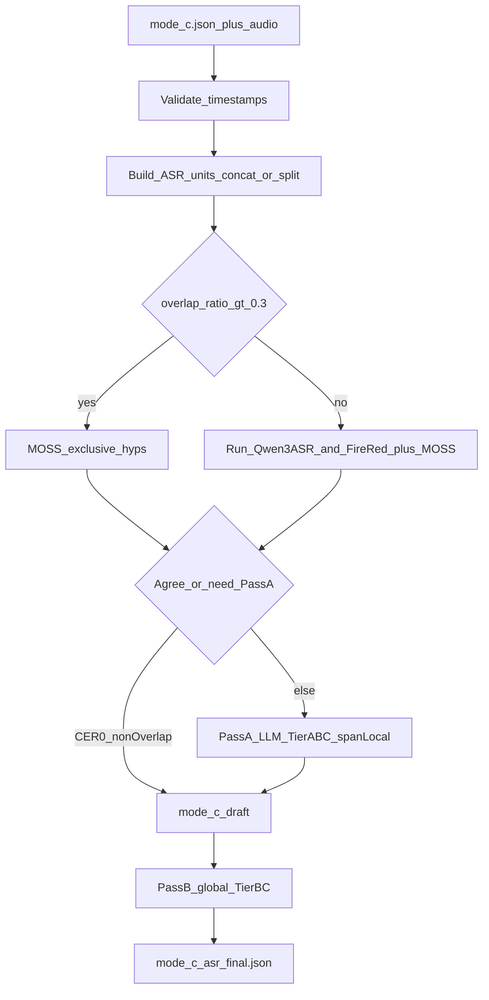

# Stage-2 Multi-ASR + LLM Fusion (Architecture)

**Date:** 2026-07-24  
**Status:** Final for implementation (pending optional 30s/60s ASR knob check)  
**Scope:** Stage-2 only — consume `diarizen_moss_fusion` (Mode C) outputs; do not re-run Stage-1 diarization fusion.

## Overview

Improve ASR accuracy on top of fused diarization turns by:

1. Validating timestamps and building same-speaker ASR units (concat / split)
2. Dynamic overlap gate → Qwen3-ASR + FireRedASR and/or MOSS-only
3. Skipping Pass A when clean hypotheses agree (CER = 0)
4. Pass A LLM select + Tier A–C repair (span-local char-count)
5. Required Pass B global consistency → `asr_status=final`

Diarization `(start, end, speaker_id)` stays frozen.

## Locked decisions

| Topic | Choice |
| ----- | ------ |
| Extra ASR | [Qwen3-ASR](https://github.com/QwenLM/Qwen3-ASR) + [FireRedASR2S](https://github.com/FireRedTeam/FireRedASR2S) (**no VAD**; **LID+Punc on**) (+ MOSS provisional when present) |
| Overlap policy | **Dynamic**: `overlap_ratio > 0.30` → **MOSS-exclusive**; `≤ 0.30` → **MOSS-primary** (base=MOSS; others advisory) |
| Overlap ratio | `union_overlap_duration(other speakers ∩ unit) / unit_duration` |
| Concat audio | Timeline crop `[unit_start, unit_end]` **through** overlap; do not excise foreign speech / fill silence |
| LLM role | Tier A/B/C only; **no context-only Tier C**; **no Tier D** |
| Char-count | **O1b span-local**: each edit `abs(len(span_out)-len(span_asr)) ≤ 1`; no abbreviation expansion (`模型`↛`大语言模型`) |
| Context window | Prefer ±10 min; **cap** nearest **20 turns** / **4096 tokens** |
| Agreement gate | Non-overlap CER=0 → skip Pass A; never let non-MOSS majority beat MOSS on overlap |
| Short skip | After concat, duration **&lt; 0.35 s** → no ASR; keep turn as timeline placeholder for Pass B |
| Invalid TS | Discard `end-start &lt; 0.01s`, NaN/Inf; log `skipped_invalid_ts`; no repair |
| Pass order | Pass A → `mode_c_draft.json` → Pass B → `mode_c_asr_final.json` |
| Judge | [Qwen3.8-27B](https://huggingface.co/Qwen/Qwen3.8-27B) @ **T=0.1**; invalid JSON retry ≤2 then best hyp (MOSS if overlap) |
| Eval B0 | **MOSS-from-fusion** (primary). Optional side baseline: single Qwen3-ASR |
| Ablation | B0 → +concat multi-ASR → +dynamic overlap → +Pass A → +Pass B |
| max_asr_seconds | Default **30**; config knob **60** pending model-card confirmation |

## Pipeline



## 1. Input validation

- Finite numeric `start`/`end` with `end > start`
- Discard `end - start < 0.01s` or NaN/Inf → `skipped_invalid_ts`
- Do not repair inverted/missing times

## 2. ASR unit construction (concat / split)

### 2.1 Concatenation (same speaker only)

Merge when all hold:

- Same `speaker_id`
- Adjacent in validated timeline
- Gap `next.start - prev.end <= 5.0 s`
- Span `unit_end - unit_start <= max_asr_seconds` (default 30)

Different speakers never concatenate. Audio = timeline crop (overlap inside span accepted).

```text
overlap_ratio = measure(union of intersections with all other speakers) / (unit_end - unit_start)
contains_overlap = overlap_ratio > 0
heavy_overlap = overlap_ratio > 0.30
```

### 2.2 Split long segments

If duration `> max_asr_seconds`: min **RMS** energy (25 ms window, ~10 ms hop), forbidden edge zone = **10%** of segment; recurse.

### 2.3 Short skip

Concat first; if still `< 0.35s` → no ASR/LLM content update; retain in timeline for Pass A neighbors / Pass B.

## 3. Multi-ASR hypotheses

- `heavy_overlap`: MOSS-only
- else: Qwen3-ASR + FireRed + MOSS (if any)
- Multi-turn MOSS: join with space or `。`; set `moss_merged=true`; map-back via timestamps or lightweight aligner
- Cache ASR under work dir

### Map back to original turns

Prefer ASR word/segment timestamps; else unit-level then aligner / relative duration fallback. Output one row per original fused turn.

## 4. Agreement gate

- Chinese CER = 0 among available hyps (light normalize)
- Non-overlap + CER=0 → skip Pass A
- Overlap: never treat Qwen==FireRed≠MOSS as consensus; base=MOSS

## 4.1 Dynamic overlap handling

| Condition | ASR | LLM base |
| --------- | --- | -------- |
| `overlap_ratio > 0.30` | MOSS only | `moss` |
| `0 < overlap_ratio ≤ 0.30` | All ASRs | `moss`; others advisory |
| no overlap | All ASRs | best under Tier A–C |

## 5. Pass A — evidence ladder + span-local char-count

**Context:** nearest ≤20 turns within ±10 min, ≤4096 tokens; optional hotwords; precomputed pinyin; overlap flags.

| Tier | Evidence |
| ---- | -------- |
| A | Select/merge spans from hyps |
| B | Exact tone-insensitive pinyin match |
| C | Pinyin edit distance ≤2 **and** anchor ∈ {neighbor_draft, meeting_draft, hotword} |

**Forbidden:** context-only fixes (no pinyin link); open-world rewrite; abbreviation expansion.

### Character-count validator (O1b, hard)

- For each edit: `abs(len(span_out) - len(span_asr)) ≤ 1`
- Reject extra nouns/numbers that are not length-matched span swaps
- On fail: retry ≤2; then fallback best hyp (MOSS if overlap)

**LLM:** T=0.1; Tier C requires `anchor`; missing `tier`/`anchor` → retry → fallback.

**Workflow:** sequential Pass A → `mode_c_draft.json`.

## 6. Pass B — required global consistency

- Input: full `mode_c_draft.json`
- Tier B/C only; MOSS-aware on overlap turns; same span-local validator
- Output `mode_c_asr_final.json` + `llm_edits.jsonl`

## 7. Artifacts

| Artifact | Role |
| -------- | ---- |
| `asr_units.json` | Concat/split, overlap_ratio, heavy_overlap, skips |
| `asr_hypotheses.json` | Per-unit hyps + cache keys |
| `mode_c_draft.json` | After Pass A |
| `mode_c_asr_final.json` | After Pass B |
| `llm_edits.jsonl` | Audits + retry counts |

## 8. Evaluation

- Metrics: CER, **cpCER**
- Ablation: **B0 = MOSS-from-fusion** → +concat multi-ASR → +dynamic overlap → +Pass A → +Pass B
- First 5% data for B0 before full runs
- Monitor invalid-JSON rate; if >5%, consider T=0.2

## 9. Judge prompt (production)

Use structured JSON (not `|...|` wrappers). Core constraints:

```text
System: Strict conservative meeting transcript corrector. Fidelity to phonetics > fluency. JSON only.

Constraints:
1. OVERLAP / heavy_overlap flags. If heavy_overlap, base_model=moss; hyps may be MOSS-only.
2. Evidence ladder Tier A → B → C (C needs pinyin edit distance ≤2 + anchor).
3. SPAN-LOCAL CHAR COUNT: for every edit, |len(span_out)-len(span_asr)| ≤ 1.
   Do not expand abbreviations. No context-only fixes without pinyin link.
4. If unsure, keep base ASR text.

Output schema:
{ "text", "base_model", "edits": [{ "span_asr", "span_out", "tier", "pinyin_asr", "pinyin_out", "anchor" }], "overlap" }
```

Few-shots: prefer length-matched repairs (e.g. 产用→采用, 单方接→单框架, 奔至→蹦字). Rewrite any example that inserts unmatched-length tokens (e.g. bare `3`).

Full expanded template (hypotheses/hotwords/neighbors placeholders) lives in the implementation module; Chinese free-form “方言专家” prompts are inspiration only.

## 10. Non-goals

- Modifying Stage-1 fusion
- Streaming / job queue / review UI
- Optimizing DER as Stage-2 objective

## 11. Open knob

- Confirm `max_asr_seconds` default 30 vs 60 after Qwen3-ASR / FireRedASR2S model limits — implementation may start with 30.

## 12. Upstream references

| Role | URL |
| ---- | --- |
| Stage-1 fusion | https://github.com/zyxciel/diarizen-moss-fusion |
| Qwen3-ASR | https://github.com/QwenLM/Qwen3-ASR |
| FireRedASR2S | https://github.com/FireRedTeam/FireRedASR2S (**ASR+LID+Punc; VAD off**) |
| Judge LLM | https://huggingface.co/Qwen/Qwen3.8-27B |
| Dialect eval (future) | https://github.com/ASLP-lab/WenetSpeech-Chuan |

